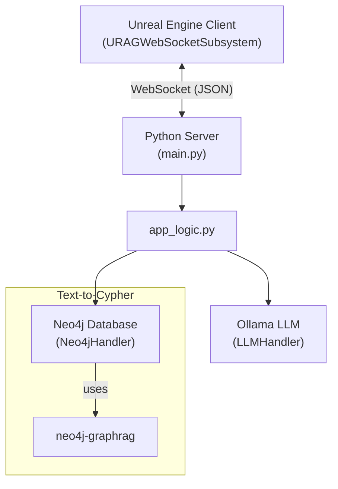

# Graph RAG AI Agent for Unreal Engine

This project provides a backend WebSocket server that connects to a Neo4j graph database and an Ollama LLM, allowing an Unreal Engine client to perform complex graph queries and have context-aware natural language conversations with an AI agent.

## Core Features

* **WebSocket Communication**: Real-time, stateful communication between the Unreal Engine client and the Python backend.
* **Text-to-Cypher Graph Queries**: Translates natural language questions like "find all connected components" into formal Neo4j Cypher queries using `neo4j-graphrag`.
* **Context-Aware NL-Streaming**: The AI can answer questions about specific graph nodes by injecting their data as context into the LLM prompt. Responses are streamed token-by-token for a real-time chat experience.
* **Dynamic LLM Configuration**: The client can dynamically update the LLM's model, temperature, persona, and talkativeness for the current session.

## Architectural Diagram



## Technology Stack

* **Backend**: Python 3.x, `websockets`, `neo4j`, `neo4j-graphrag`, `Ollama`
* **Frontend**: Unreal Engine, C++
* **Protocol**: WebSocket with JSON payloads

## Prerequisites

* Python 3.9+ and Pip
* Unreal Engine 5.x
* Skyreal

## Setup and Running

### 1. Backend Server

1.  Navigate to the Python server directory.
2.  Create and activate a virtual environment:
    ```bash
    python -m venv venv
    source venv/bin/activate
    ```
    >Note: If you try to run this server from windows powershell instead of linux, please use instead :
    ```bash
    python -m venv venv
    venv/scripts/activate
    ```
3.  Install dependencies from `requirements.txt`:
    ```bash
    pip install -r requirements.txt
    ```
4.  Create a `.env` file in the root of the python directory. Use the provided `.env.example` as a template and add your credentials.
5.  Run the server:
    ```bash
    python main.py
    ```
    The server will start and listen on the host and port specified in your configuration (default `ws://0.0.0.0:8765`).

### 2. Unreal Engine Client

**Important:** This repository contains the source code for the **Python backend server only**. The corresponding Unreal Engine client, which is designed to communicate with this server, is located in a separate repository here:

- **Unreal Client Repository**: https://gricad-gitlab.univ-grenoble-alpes.fr/mimesis/ai_agent_plugin

1.  After opening the Unreal project, if prompted, allow the engine to build the game modules. The AgentAI_API macro in the C++ code identifies it as a core part of the project. 
2.  In your Blueprints, you can get a reference to the WebSocket functionality using the "Get RAG WebSocket Subsystem" node.
3.  From the subsystem reference, you can call functions like `Connect To RAG Server`, `Send Natural Language Query`, and bind events to the corresponding delegates (e.g., `OnNaturalLanguageStreamChunkReceived`) to handle responses from this server.

## Creating a Standalone Executable

You can package the Python backend into a single .exe file for easy distribution on Windows. This allows the server to run without needing a full Python installation on the target machine.

1. Install PyInstaller:
First, ensure you have `pyinstaller` installed in your virtual environment:
    ```bash
    pip install pyinstaller
    ```
2. Build the Executable:
From your project's root directory (where `main.py` is located), run the following command:
    ```bash
    pyinstaller --onefile main.py
    ```
The --onefile flag bundles everything into a single executable file.

3. Run the Executable:
After the process completes, you will find the `main.exe` file inside a new `dist` folder.

**Important:** You must place your `.env` configuration file in the same `dist` folder next to `main.exe` for the server to load the necessary settings.

**Important** Look line 38 inside the config.py file and uncomment `WEBSOCKET_HOST = "0.0.0.0"` and comment the other one before packaging the project for the server PC (if you don't do this, it will only listen locally)